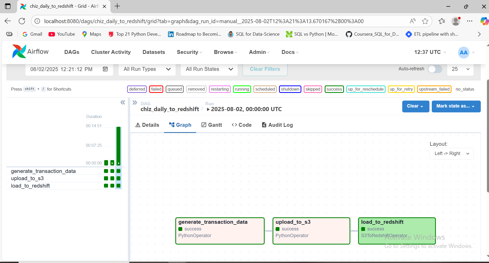

# Randomized_stock_pipeline_using_redshift
This project simulates transactional data for a fictional stock market to monitor the daily value of various stocks. It then builds a complete data pipeline that moves the generated data from local simulation to analytics-ready storage in Amazon Redshift.
The pipeline is designed to mirror a real-world scenario, where stock data is produced in large volumes, stored in the cloud, processed, and analyzed—all using automated, scalable tools.


## 🧰 Tools & Technologies

| Tool              | Role                                            |
|-------------------|-------------------------------------------------|
| **Apache Airflow** | Orchestration of DAGs and scheduling            |
| **Python**         | Simulation scripts and data processing          |
| **Faker + pandas** | Synthetic stock transaction generation          |
| **AWS S3**         | Data lake for raw Parquet storage               |
| **Amazon Redshift**| Data warehouse for querying and dashboards      |
| **Docker**         | Containerized Airflow environment               |
| **Terraform**      | Infrastructure as Code for S3, Redshift, etc.  |


##  DAG Overview
The DAG is named `chiz_daily_to_redshift` and includes three main tasks:

- `generate_transaction_data` – PythonOperator  
- `upload_to_s3` – PythonOperator  
- `load_to_redshift` – S3ToRedshiftOperator
  


All tasks complete successfully as shown above, indicating a healthy DAG run.

## 🚀 How to Run Locally

1. **Clone the Repository**
   ```bash
   git clone https://github.com/your-username/randomized_stock_pipeline.git
   cd randomized_stock_pipeline


  #### Output
-  Daily Parquet files uploaded to your specified S3 bucket
- Transaction data ingested into Amazon Redshift table
- Data is ready for downstream analytics and dashboarding

   
